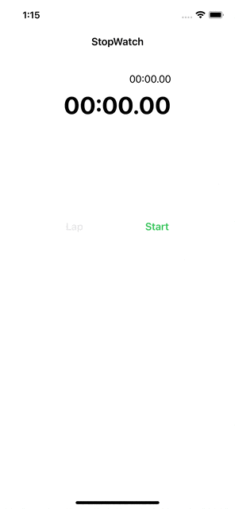

## 프로젝트 2 : Stopwatch

### 1st Commit : 화면 레이아웃 설정 및 버튼 동작 구현
#### 날짜 : 2023.04.22

#### 구현사항
- 화면 레이아웃 설정
    - 스토리보드로 작업
- 버튼 동작 구현
    - 선택시 버튼의 title 및 color가 변경되도록 함.

### 2nd Commit : 스톱워치 기능 구현
#### 날짜 : 2023.04.24

#### 구현사항
- BackgroundTimer Class 구현
    - main run loop에서 동작하는 NSObject의 Timer 클래스 대신 다른 쓰레드에서 동작하는 DispatchSourceTimer 클래스를 구현하는 BackgroundTimer Class 생성
    - ViewController에서 버튼 이벤트마다 알맞은 타이머 동작(정지,시작,종료) 구현

### 3rd Commit : 랩타임 테이블 뷰 구현
#### 날짜 : 2023.04.25

#### 구현사항
- 테이블뷰 구현
    - 스토리보드 상에서 delegate,datasource 최상위 뷰 연결
    - UITableViewCell 의 Identifier 및 subView의 ViewTag 설정을 통한 셀 UI 적용
    - 랩 타임 기록 및 초기화 로직 구현

### 4th Commit : 코드 리팩토링
#### 날짜 : 2023.04.26

#### 구현사항
- 전체 코드 정비
    - 버튼 Constraint 재설정 : 기존 totalTimeLabel와의 Constraint를 safeLayoutGuide로 변경.
    - 공통되는 로직 함수로 분리
    - 주석 작성 및 변수명, 함수명 수정

### 실행화면

